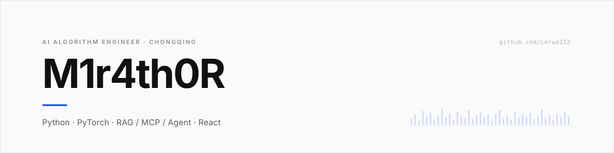

### 关于

算法工程。习惯把一件事做完整：从数据清洗、模型训练，一路到打包成别人能直接点开用的东西。

目前在工业制造场景做缺陷检测与良率分析。

---

### 精选项目

**[screenshare-p2p](https://github.com/Leruo212/screenshare-p2p)** &nbsp;`WebRTC` `PeerJS` `Vanilla JS`

浏览器点对点屏幕共享，不需要任何云服务器。把链接发给对方，点开就能看 —— 信令只走公共 broker，画面端到端直连。
→ [在线入口](https://leruo212.github.io/screenshare-p2p/screenshare.html)

**[boe-growth-agent](https://github.com/Leruo212/boe-growth-agent)** &nbsp;`React 19` `Express 5` `Coze API`

对话式工作记录助手。随口说今天做了什么，自动整理成日 / 周 / 月 / 季 / 年结构化报告，附带成长亮点识别。

**[chinese-relative-title-calculator](https://github.com/Leruo212/chinese-relative-title-calculator)** &nbsp;`Python`

中国亲戚称呼推算 —— 「我爸爸的表哥的女儿我该叫什么」，算个准话。

---

### 技术栈

| | |
|---|---|
| **语言** | Python · JavaScript / TypeScript · SQL |
| **建模** | PyTorch · CNN / Transformer · 自监督表示学习 |
| **应用** | RAG · MCP · Agent · React · Node.js |

---

### 联系

📮 <a href="mailto:m4rh0zen@foxmail.com">m4rh0zen@foxmail.com</a>
