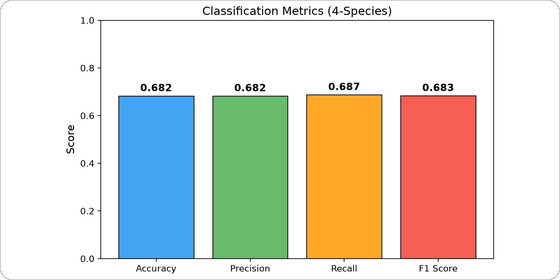
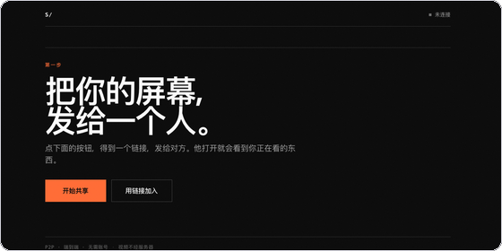
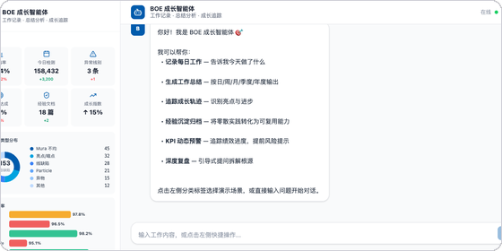
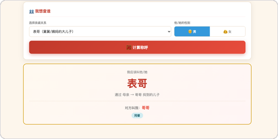

### 关于

算法工程。习惯把一件事做完整：从数据清洗、模型训练，一路到打包成别人能直接点开用的东西。

目前在工业制造场景做缺陷检测与良率分析。

---

### 精选项目

<table>
<tr>
<td width="50%" valign="top">
  
   
  <b><a href="https://github.com/Leruo212/dna-ssl-project">dna-ssl-project</a></b>
   
  <code>PyTorch</code> <code>自监督学习</code> <code>生物信息</code>
    
  用掩码重构在未标注的基因组片段上预训练 CNN 编码器，再迁移到四物种分类。附完整训练日志、t-SNE 可视化，以及一份把失败原因查到根上的复盘。
</td>
<td width="50%" valign="top">
  
   
  <b><a href="https://github.com/Leruo212/screenshare-p2p">screenshare-p2p</a></b>
   
  <code>WebRTC</code> <code>PeerJS</code> <code>Vanilla JS</code>
    
  浏览器点对点屏幕共享，不需要任何云服务器。把链接发给对方，点开就能看 —— 信令只走公共 broker，画面端到端直连。
   
  → <a href="https://leruo212.github.io/screenshare-p2p/screenshare.html">在线入口</a>
</td>
</tr>
<tr>
<td colspan="2">&nbsp;</td>
</tr>
<tr>
<td width="50%" valign="top">
  
   
  <b><a href="https://github.com/Leruo212/boe-growth-agent">boe-growth-agent</a></b>
   
  <code>React 19</code> <code>Express 5</code> <code>Coze API</code>
    
  对话式工作记录助手。随口说一句今天做了什么，自动整理成日 / 周 / 月 / 季 / 年结构化报告。
</td>
<td width="50%" valign="top">
  
   
  <b><a href="https://github.com/Leruo212/chinese-relative-title-calculator">chinese-relative-title-calculator</a></b>
   
  <code>Python</code> <code>零依赖</code>
    
  中国亲戚称呼推算 —— 「我爸爸的表哥的女儿我该叫什么」，算个准话。
</td>
</tr>
</table>

---

### 技术栈

| | |
|---|---|
| **语言** | Python · JavaScript / TypeScript · SQL |
| **建模** | PyTorch · CNN / Transformer · 自监督表示学习 |
| **应用** | RAG · MCP · Agent · React · Node.js |

---

### 联系

📮 <a href="mailto:m4rh0zen@foxmail.com">m4rh0zen@foxmail.com</a>
